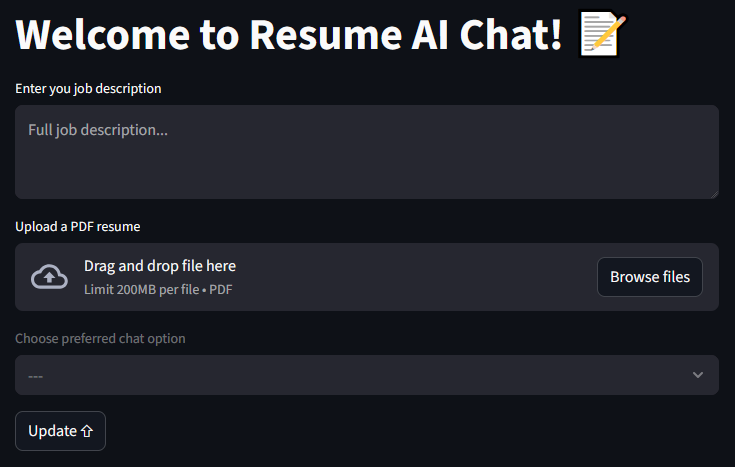

# ollama-ai-resume-chat
Using ollama to improve a resume and do a fake interview using qwen2.5-coder:7b and nomic-embed-text.

A resume AI that helps in interacting with your resume in 2 ways:
- Enhance Resume: \
    In "Enhance Resume", the agent analyzes your resume, compares it to the job summary, and makes suggestions to improve job entries.
- Simulate Interview: \
    In "Simulate Interview", the agent will ask you questions based on your resume similar to a job interview.

The sample resume used in this application came from https://code.ics.uci.edu/wp-content/uploads/2020/06/Resume-Sample-1-Software-Engineer.pdf

## Installation
```
pip install -r requirements.txt
```

## Usage
On the command line in the project directory, run the following command:
```
streamlit run resume_ui.py
```



## Python project requirements include:
#### ollama
https://ollama.com/ \
Ollama must be installed and running with the prefered models 'qwen2.5-coder:7b' and 'nomic-embed-text' already downloaded.

#### langchain-core
https://pypi.org/project/langchain-core/ \
LangChain Core contains the base abstractions that power the LangChain ecosystem.

#### langchain
https://pypi.org/project/langchain/ \
LangChain is the easiest way to start building agents and applications powered by LLMs.

#### langgraph
https://pypi.org/project/langgraph/ \
LangGraph provides low-level supporting infrastructure for any long-running, stateful workflow or agent

#### langchain-community
https://pypi.org/project/langchain-community/ \
LangChain Community contains third-party integrations that implement the base interfaces defined in LangChain Core, making them ready-to-use in any LangChain application.

#### langchain-classic
https://pypi.org/project/langchain-classic/
Legacy chains, langchain-community re-exports, indexing API, deprecated functionality, and more.

#### langchain-ollama
https://pypi.org/project/langchain-ollama/ \
This package contains the LangChain integration with Ollama.

#### faiss-cpu
https://pypi.org/project/faiss-cpu/ \
A library for efficient similarity search and clustering of dense vectors.

#### PyMuPDF
https://pypi.org/project/PyMuPDF/ \
A high performance Python library for data extraction, analysis, conversion & manipulation of PDF (and other) documents.

#### streamlit
https://pypi.org/project/streamlit/ \
Streamlit lets you easily transform Python scripts into interactive web apps.
